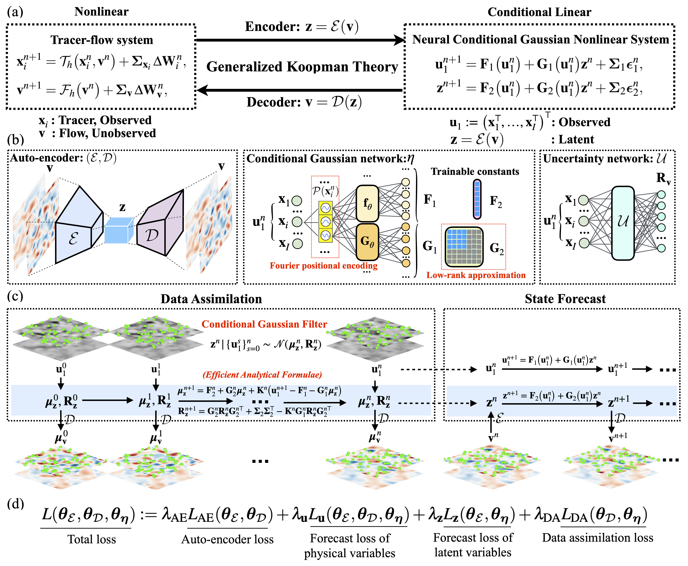

# A Lagrangian Conditional Gaussian Koopman Network (LaCGKN) for Data Assimilation and Prediction


Lagrangian data assimilation seeks to recover hidden Eulerian flow fields from sparse and indirect observations of moving tracers. This problem is fundamentally challenging because of the nonlinear coupling between tracer trajectories and the underlying flow, rendering posterior inference computationally intractable for realistic, high-dimensional systems. In this work, we develop a Lagrangian conditional Gaussian Koopman network (LaCGKN), a structure-preserving and data-driven framework for joint data assimilation and prediction from Lagrangian observations. LaCGKN embeds the Eulerian flow dynamics into a low-dimensional latent space governed by a nonlinear stochastic system with conditional Gaussian structures, enabling analytic posterior updates without ensemble forecasting. Different from existing conditional Gaussian Koopman formulations that rely on direct Eulerian observations, the Lagrangian setting introduces additional constraints on the latent representation, which must simultaneously encode the flow dynamics and mediate nonlinear tracer-flow interactions. To address these challenges, the LaCGKN incorporates three key architectural components: (i) tracer homogenization to enforce permutation equivariance and enable generalization across varying numbers of tracers; (ii) Fourier-based positional encoding to capture spatial dependence and reconstruct local flow features at moving tracer locations; and (iii) an SVD-inspired low-rank parameterization of the latent transition operator, which reduces parameter complexity while preserving expressive capacity. An application to a two-layer quasi-geostrophic flow with surface tracer observations demonstrates that LaCGKN achieves accurate and efficient Lagrangian data assimilation and prediction, without reliance on ensemble methods or the governing physical model. These results establish the LaCGKN as a unified and computationally tractable alternative to both traditional model-based approaches and purely black-box data-driven methods.

## Paper
If you find the code useful, please consider citing the paper 
```

```
